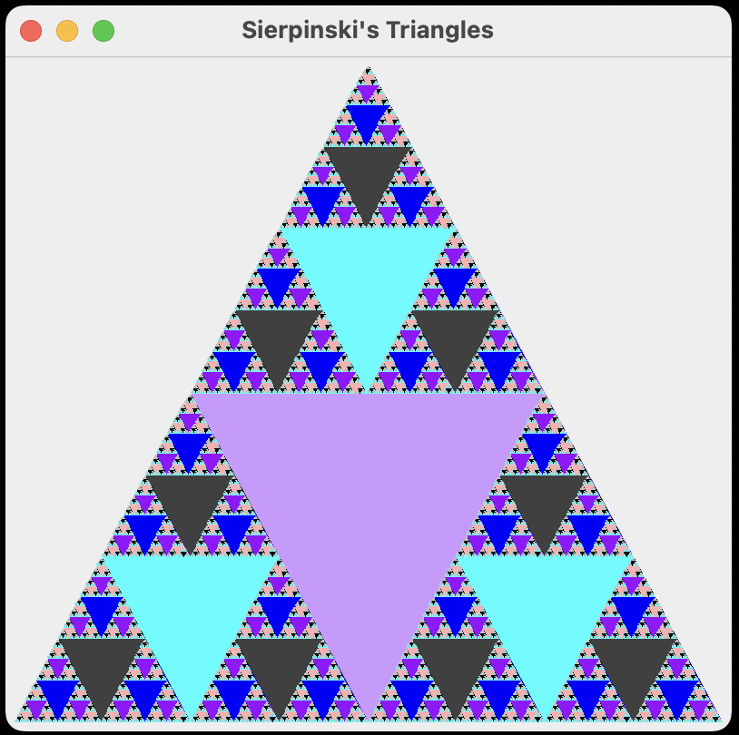

# SierpinskiTriangleViewer

This is a simple Java Swing project that generates and displays the Sierpinski triangle. The Sierpinski triangle is a fractal named after the Polish mathematician Wacław Sierpiński. It is formed by recursively subdividing an equilateral triangle into smaller equilateral triangles.

## Preview



## Running The Program (Double Click Alternative)

Download SierpinskiTriangle.jar from this repository. <br/>
Make sure you have Java installed. To check, open terminal and type "java -version".<br/>
```bash
java -version
```
My current Java version.
``` bash
java version "20.0.1" 2023-04-18
Java(TM) SE Runtime Environment (build 20.0.1+9-29)
Java HotSpot(TM) 64-Bit Server VM (build 20.0.1+9-29, mixed mode, sharing)
```
In the terminal, enter the directory where the SierpinskiTriangle.jar is downloaded. <br/>
For example, all my downloaded files are inside the downloads folder, so I would enter the downloads directory.
``` bash
cd downloads
```
Then run the command below to run the SierpinskiTriangle.jar file.
``` bash
java -jar SierpinskiTriangle.jar
```

## License
This project is licensed under the MIT License. Feel free to use and modify the code for your own purposes.
